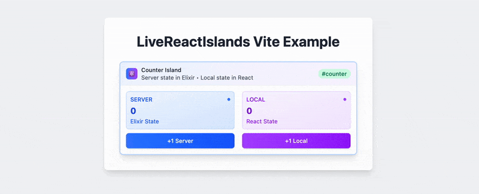

# LiveReactIslands

Work in Progress - under active development, not intended for public use.

React Islands for Phoenix LiveView - Embed React components in LiveView with bidirectional communication, server-side rendering, and global state management.

## Demo



## Features

- Embed React components directly in Phoenix LiveView
- Bidirectional communication - props flow from LiveView to React, events flow from React to LiveView
- Optional server-side rendering with caching
- Global state management across islands
- Prop ownership tracking for internal vs external updates
- Shared React root using portals for efficient resource usage
- TypeScript support

## Packages

Monorepo packages:

- `live_react_islands` - Phoenix LiveView integration (Elixir)
- `@live-react-islands/core` - React hooks and SSR support (JavaScript/TypeScript)
- `live_react_islands_ssr_vite` - Dev mode SSR backend using Vite (Elixir)
- `live_react_islands_ssr_deno` - Production SSR backend using Deno (Elixir)
- `examples/with-esbuild` - esbuild example
- `examples/with-vite` - Vite example

## Quick Start

### Installation

Elixir (mix.exs):

```elixir
def deps do
  [
    {:live_react_islands, "~> 0.1.0"}
  ]
end
```

JavaScript:

```bash
npm install @live-react-islands/core react react-dom
```

### Configuration

SSR configuration is optional. See the [SSR section](#server-side-rendering-ssr) for details.

### Basic Usage

1. Create a React Island Component (Elixir):

```elixir
defmodule MyAppWeb.Components.CounterIsland do
  use LiveReactIslands.Component,
    component: "Counter",
    props: %{count: 0},
    ssr_strategy: :none

  def handle_event("increment", _params, socket) do
    new_count = socket.assigns.count + 1
    {:noreply, socket |> update_prop(:count, new_count)}
  end
end
```

2. Create the React Component:

```jsx
// assets/js/components/Counter.jsx
export default function Counter({ count, pushEvent }) {
  return (
    <div>
      <h2>Count: {count}</h2>
      <button onClick={() => pushEvent("increment", {})}>Increment</button>
    </div>
  );
}
```

3. Use it in your LiveView:

```elixir
defmodule MyAppWeb.PageLive do
  use MyAppWeb, :live_view

  def render(assigns) do
    ~H"""
    <.live_component module={MyAppWeb.Components.CounterIsland} id="counter" />
    """
  end
end
```

## Key Concepts

### Prop Ownership

LiveReactIslands tracks which component owns each prop:

- Internal Owned: LiveComponent manages the prop (LiveComponent → React)
- External Owned: LiveView manages the prop, passed down through LiveComponent (LiveView → LiveComponent → React)

### Event Communication

React components receive `pushEvent` as a prop to send events to the LiveComponent:

```jsx
function MyComponent({ pushEvent }) {
  const handleClick = () => {
    pushEvent("my_event", { data: "value" });
  };
  // ...
}
```

### Global State

Share state across islands by declaring globals in your LiveView and requesting them in your island components.

LiveView:

```elixir
defmodule MyLiveView do
  use MyAppWeb, :live_view
  use LiveReactIslands.LiveView, expose_globals: [:theme, :user]

  def mount(_params, _session, socket) do
    socket = socket
    |> assign(:theme, "dark")
    |> assign(:user, %{name: "Alice"})

    {:ok, socket}
  end
end
```

Island Component:

```elixir
defmodule MyAppWeb.Components.ThemedCounter do
  use LiveReactIslands.Component,
    component: "ThemedCounter",
    props: %{count: 0},
    globals: [:theme, :user]  # Request globals you need
end
```

React Component:

```jsx
function ThemedCounter({ theme, user, count, pushEvent }) {
  return (
    <div className={theme}>
      <p>Welcome, {user.name}!</p>
      <p>Count: {count}</p>
    </div>
  );
}
```

When globals change in LiveView, all islands that requested those globals automatically re-render.

Create an `islands/index.js` file to export all islands, ensuring client and server use the same island map:

```javascript
// islands/index.js
import Counter from "./Counter";
import TodoList from "./TodoList";

export default { Counter, TodoList };
```

To sync globals to a Zustand/Redux store:

```jsx
function MyIsland({ theme, user, count }) {
  const store = useStore();

  // Sync globals to your store if needed
  useEffect(() => {
    store.setState({ theme, user });
  }, [theme, user]);

  return (
    <div className={theme}>
      <p>Welcome, {user.name}!</p>
      <p>Count: {count}</p>
    </div>
  );
}
```

### Server-Side Rendering (SSR)

LiveReactIslands supports SSR with strategy-aware rendering. The system automatically chooses between `renderToString` or `renderToStaticMarkup` based on your strategy.

1. Create an islands index file:

```javascript
// islands/index.js
import Counter from "./Counter";
import TodoList from "./TodoList";

export default { Counter, TodoList };
```

2. Client entry point:

```javascript
// app.js
import { createHooks } from "@live-react-islands/core";
import islands from "./islands";
import { Socket } from "phoenix";
import { LiveSocket } from "phoenix_live_view";

const hooks = createHooks({ islands });

const liveSocket = new LiveSocket("/live", Socket, {
  hooks: { ...hooks },
});

liveSocket.connect();
```

3. Server entry point:

```javascript
// ssr.js - works with Deno, Node, Bun, or any JS runtime
import { exposeSSR } from "@live-react-islands/core/ssr";
import islands from "./islands";

exposeSSR({ islands });
```

To wrap all islands in a shared context provider:

```javascript
import { exposeSSR } from "@live-react-islands/core/ssr";
import islands from "./islands";

const SharedContextProvider = ({ children }) => {
  return children;
};

exposeSSR({ islands, SharedContextProvider });
```

Both client and server import from the same `./islands` file. The `exposeSSR` function sets up a global `SSR_MODULE` object that the Elixir renderer calls.

4. Configure SSR backend:

Development (Vite):

```elixir
# config/dev.exs
config :live_react_islands,
  ssr_renderer: LiveReactIslands.SSR.ViteRenderer
```

Production (Deno):

```elixir
# config/prod.exs
config :live_react_islands,
  ssr_renderer: LiveReactIslands.SSR.DenoRenderer

config :live_react_islands_ssr_deno,
  main_module_path: "priv/static/assets/ssr.js"
```

5. Enable SSR in your LiveComponent:

```elixir
defmodule MyAppWeb.Components.CounterIsland do
  use LiveReactIslands.Component,
    component: "Counter",
    props: %{count: 0, title: "My Counter"},
    ssr_strategy: :hydrate_root  # or :overwrite, :none
end
```

### SSR Strategies

#### `:none` (Default)

Client: React mounts on empty container
Server: No SSR

Drawbacks:
- No SEO content
- Visual flicker - page renders without island content, then pops in when JS loads

Use case: Purely interactive components where initial render doesn't matter

#### `:overwrite` (Recommended)

Client: React replaces server HTML with `createRoot` in a shared root
Server: Uses `renderToStaticMarkup`

Architecture: All islands share a single React root using portals

Benefits:
- SEO-friendly content in first render
- No visual flicker
- Better performance through shared React root
- Islands can share context (enables drag-and-drop between islands, shared providers)
- No strict DOM matching required

Use case: Most islands, especially when cross-island features or shared context are needed

#### `:hydrate_root`

Client: React hydrates existing DOM with `hydrateRoot` in individual roots
Server: Uses `renderToString`

Architecture: Each island gets its own independent React root

Benefits:
- Prevents re-render of large islands (hydration reuses server HTML)
- Fastest perceived interactivity for complex components

Tradeoffs:
- Islands cannot share context (each has isolated React root)
- Requires strict DOM matching between server and client

Use case: Large, complex islands where avoiding the initial re-render is critical

### How Props Work

Props are automatically embedded in the HTML as a `data-props` attribute:

```html
<div id="counter" data-props='{"count":0,"title":"My Counter"}'>
  <!-- SSR content here -->
</div>
```

The client reads this attribute at mount time, ensuring props are available synchronously without waiting for LiveView events.

### Runtime Flexibility

The SSR system is runtime-agnostic. The same JavaScript code works with:

- Vite Dev Server (development with HMR)
- Deno
- Node.js
- Bun

Configure the appropriate renderer in your Elixir config.

## Development

### Setup

```bash
# Clone the repository
git clone https://github.com/live_react_islands/live-react-islands.git
cd live-react-islands

# Install JavaScript dependencies
yarn install

# Build packages
yarn build
```

### Running Examples

```bash
cd examples/with-esbuild  # or examples/with-vite
mix deps.get
yarn install
yarn watch  # or yarn dev for Vite
mix phx.server  # in another terminal
```

## Contributing

See [Contributing Guide](./CONTRIBUTING.md).

## License

MIT License - see [LICENSE](./LICENSE) for details.

## Credits

Created by David Czaplinski

Inspired by the islands architecture pattern and existing Phoenix-React integration libraries.
